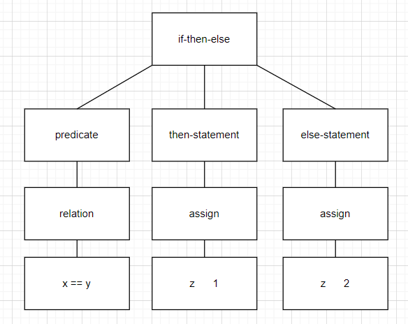

# Learning about compilers <!-- omit in toc -->

## Compiler structure <!-- omit in toc -->

- [**1. Lexical analysis**](#1-lexical-analysis)
  - [**Implementation (in progress)**](#implementation-in-progress)
- [**2. Parsing**](#2-parsing)
- [**3. Semantic analysis**](#3-semantic-analysis)
- [**4. Optimization**](#4-optimization)
- [**5. Code generation**](#5-code-generation)

### **1. Lexical analysis**

*divides source code into "tokens"*

```
Token == <class, lexeme>
```

Lexemes are substrings of the original source code string.

**Example: Extracting tokens from a source code string.**

```
if x == y then z = 1; else z = 2;
```

| Class       | Lexemes              |
|-------------| ---------------------|
| Keyword     | `if`, `then`, `else` |
| Identifier  | `x`, `y`, `z`        |
| Operator    | `==`, `=`            |
| Number      | `1`, `2`             |
| Punctuation | `;`                  |
| Whitespace  | ` `                  |

The token classes listed above are not standardized. During programming language design, designers typically use [regular languages](https://en.wikipedia.org/wiki/Regular_language) to define the token classes and what strings belong in each of them. Regular languages are typically defined using regular expressions. Therefore regular expressions can be used for extracting tokens from source code.

#### **Implementation (in progress)**

1. Write a regular expression ***R<sub>i</sub>*** for each token class so that it matches each lexeme belonging to that class.
   - For example, for the Number class the following regular expression could be used: `\d+`  
2. Form a union ***R*** out of the regular expressions written in the first step (***R = R<sub>1</sub> | R<sub>2</sub> | R<sub>3</sub> | ...***). This union is supposed to match all the valid lexemes of the language.
3. Iterate the input string ***X*** sconsisting of ***s = x<sub>1</sub>...x<sub>n</sub>*** characters. For ***1 <= i <= n*** check whether ***R*** matches ***s***.
   - If it matches, remove ***s*** from ***X***.
4. Repeat step 3 until ***X*** is empty.

### **2. Parsing**

*forms a tree from "tokens" received from lexical analysis*

`if x == y then z = 1; else z = 2;`



### **3. Semantic analysis**

*catches **inconsistencies** in source code*

Natural language example:

"Jack said Jerry left **his** assignment at home."

Does Jack talk about his own assignment or Jerry's assignment? This kind of ambiguity is not present in proper programming languages due to their rules:

```rust
fn main() {
    let person: &str = "Jack";
    {
        let person: &str = "Jerry";
        //Jerry's ...
        println!("{}'s assignment is at home.", person);
    }
    // Jack's ...
    println!("{}'s assignment is at home.", person);
}
```

### **4. Optimization**

*modifies a program so that it runs as efficiently as possible without compromising its original meaning or functionality*

Natural language example:

"It is a little bit like editing" -> "It is akin to editing".

Naive code example:

"X = Y * 0" -> "X = 0"

But what if Y is not an integer? Even if Y was a float, this would still be an invalid optimization because of [NaN](https://stackoverflow.com/questions/30242196/is-floating-point-multiplication-by-zero-guaranteed-to-produce-zero).

### **5. Code generation**

*translates input code into output code of a different language (typically assembly code)*

## Credits <!-- omit in toc -->

This README was written based on the Stanford undergraduate course "Compilers" lectures available at [edX](https://www.edx.org/course/compilers).